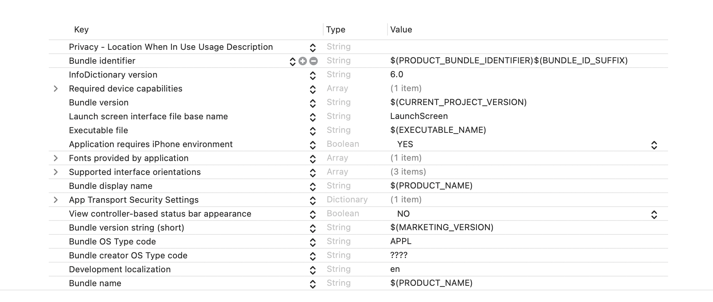
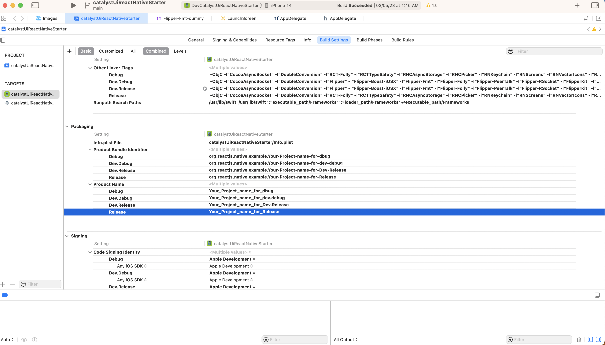
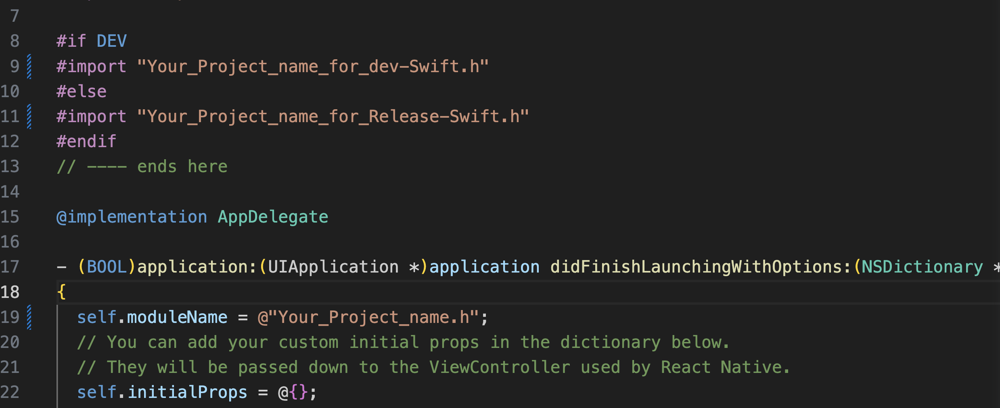
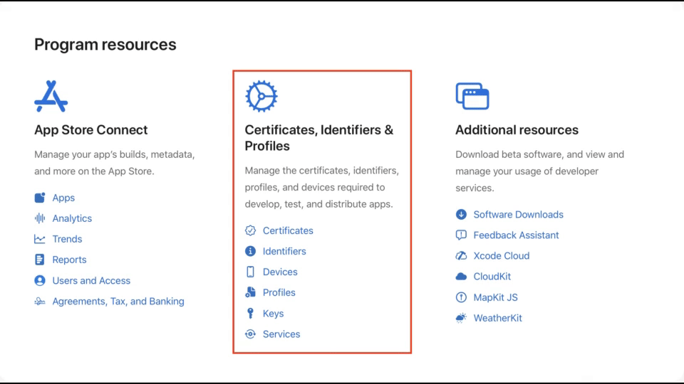
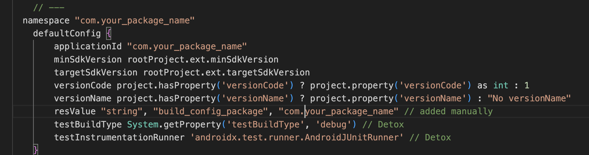

To change the existing module name and product name to a different custom name ,we need to make the following changes:

## For iOS

- In xcode ,inside build setting of the project,change the existing product name to the custom one ,
  

- as `bundle Identifier` is an amalgamation of `product bundle_indentifier` and `bundle_suffix` in our case,and `product_bundle_indentifier` is basically **auto generated** using the `product_name`,So by changing a `product_name` , new `product_bundle_indentifier` and`new bundle_indentifier will be created.

 
  
 
           
 - We have defined our own suffixes to differentiate between different schemes (for ex. **.dev for dev**)
 - Now in `App Delegate.mm` change the imports of swift file according to the customProduct name

 
  

 
  ### iOS Distribution

- In ADP portal first create a [bundle identifier](https://developer.apple.com/help/account/manage-identifiers/register-an-app-id 'bundle identifier') with the `bundle_id` of the app.
- Then Add the devices to ADP portal by following the [link](https://developer.apple.com/help/account/register-devices/register-a-single-device/ 'link') provided.
- Create a signing certificate by following the steps in the [docs](https://developer.apple.com/help/account/create-certificates/create-developer-id-certificates 'docs').
- After creating the certificates then create the provisioning profile based on your requirement. To create that you can follow the steps mentioned [here](https://developer.apple.com/help/account/manage-profiles/create-an-ad-hoc-provisioning-profile 'here').
- **Download** the provisioning profile and import it in the Xcode (Project -> Sigining & capabilities -> prefered scheme). Then enable the **automatically managed sign-in** of Xcode.

  

## For Android

- In `build.gradle` file present in `android/app` ,change the things shown in the image below:

  

- In all `.java files` change the `package` name to your custom project name,

          package com.catalystuireactnativestarter ----> package com.your_product_name

- In `strings.xml` file( `android/app/main/res/values for release` and `android/app/development/res/values for dev`),change the app name to your custom name
